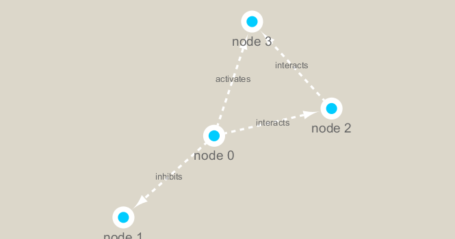

```{r setup, include=FALSE}
knitr::opts_chunk$set(echo = TRUE)
```

## Setup Cytoscape and R Connection

We will use the **RCy3** and **igraph** packages in this class

```{r}
# BiocManager::install("RCy3")
# install.packages("igraph")
```

```{r}
library(RCy3)
library(igraph)
```

Check if connected to Cytoscape

```{r}
cytoscapePing()
```

```{r}
cytoscapeVersionInfo()
```

Make a simple graph

```{r}
g <- makeSimpleIgraph()
createNetworkFromIgraph(g,"myGraph")
```

Change the network display style

```{r}
setVisualStyle("Marquee")
```

```{r}
fig <- exportImage(filename="demo_marquee", type="png", height=350)


```

## Read our metagenomics data

```{r}
prok_vir_cor <- read.delim("virus_prok_cor_abundant.tsv", stringsAsFactors = FALSE)

## Have a peak at the first 6 rows
head(prok_vir_cor)
```

Use the igraph function **graph.data.frame()** to make a network graph

```{r}
g <- graph.data.frame(prok_vir_cor, directed = FALSE)
```

```{r}
plot(g)
```

turn the node (vertex) labels off in this plot

```{r}
plot(g, vertex.label=NA)
```

Make the vertex smaller

```{r}
plot(g, vertex.size=3, vertex.label=NA)
```

Send this network to Cytoscape

```{r}
createNetworkFromIgraph(g,"myIgraph")
```

## Network Community Detection

```{r}
cb <- cluster_edge_betweenness(g)
```

```{r}
plot(cb, y=g, vertex.label=NA,  vertex.size=3)
```

## Node Degree

```{r}
# Calculate and plot node degree of our network
d <- degree(g)
hist(d, breaks=30, col="lightblue", main ="Node Degree Distribution")
```

```{r}
plot( degree_distribution(g), type="h" )
```

## Read taxonomic classification for network annotation

```{r}
phage_id_affiliation <- read.delim("phage_ids_with_affiliation.tsv")
head(phage_id_affiliation)
```

```{r}
bac_id_affi <- read.delim("prok_tax_from_silva.tsv", stringsAsFactors = FALSE)
head(bac_id_affi)
```

## Add taxonomic annotation data to network


